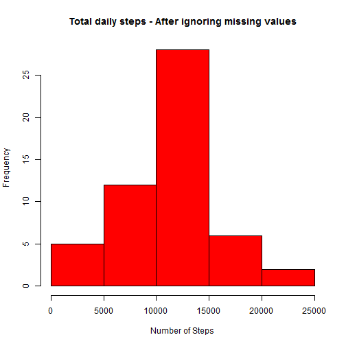
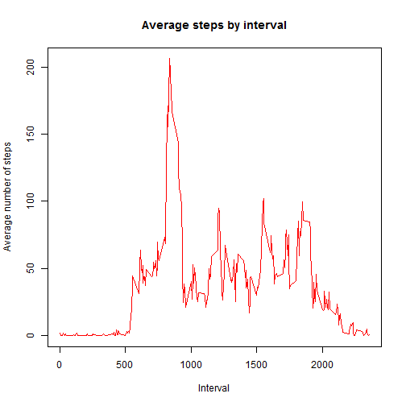
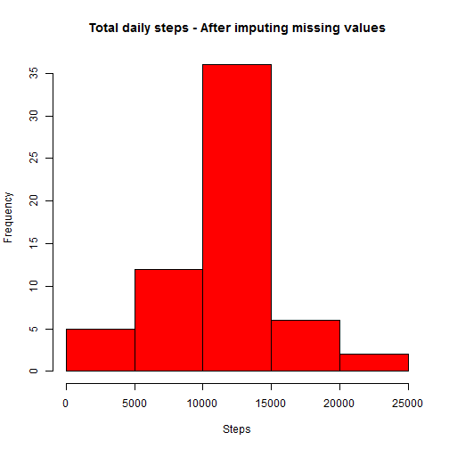
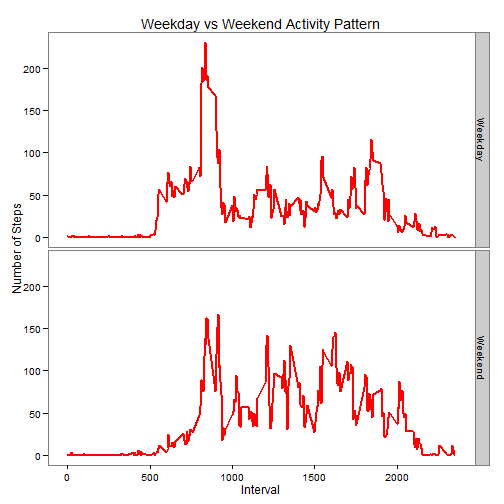

Analysis of personal movement data
==================================

In this document, we analyse the data collected from a personal activity monitoring device. 
The device collected the data at 5 minute intervals through out the day. The data consists of two months of data from an anonymous individual collected during the months of October and November 2012 and include the number of steps taken in 5 minute intervals each day.

# Reproducible Research: Peer Assessment 1

## Loading and preprocessing the data

#### It is assumed that the data is located in your working directory

```r
data = read.csv("activity.csv", header=TRUE)
```


## What is mean total number of steps taken per day?

#### Total daily steps - After ignoring the missing values

```r
# Remove missing data
ignorenadata <- data[!is.na(data$steps), ]

# Calculate total daily steps
dailysteps = aggregate(ignorenadata$steps, by=list(ignorenadata$date), sum)
colnames(dailysteps) <- c("date", "steps")

# Plot the histogram of total daily steps
hist(dailysteps$steps, xlab="Number of Steps", col="red", main="Total daily steps - After ignoring missing values")
```

 

```r
# Calculate mean and median
mn <- mean(dailysteps$steps)
md <- median(dailysteps$steps)
```

After **ignoring** NAs, the mean daily steps is **10766** and the median daily steps is **10765**.


## What is the average daily activity pattern?

#### Average number of steps for each interval across all the days 

```r
# Calculate avg steps by interval
avgsteps = aggregate(data$steps, by=list(data$interval), mean, na.rm=TRUE)

colnames(avgsteps) <- c("interval", "steps")

# Plot the chart
plot(avgsteps$interval, avgsteps$steps, type="l", xlab="Interval", ylab = "Average number of steps", col="red", main="Average steps by interval")
```

 

```r
# Find the interval with maximum average steps
maxstepsinterval <- avgsteps[which.max(avgsteps$steps), "interval"] 
```

The maximum steps occur at interval **835**.


## Imputing missing values

#### Total number of missing values in the dataset 

```r
mv <- sum(is.na(data$steps))
```

Total number of missing values in the dataset is **2304**.

#### New dataset with the missing data filled in with the avg steps of the corresponding interval

```r
newdata <- data
for (i in 1:nrow(newdata)) {
        if (is.na(newdata[i, "steps"])) {
               newdata[i, "steps"] <- avgsteps[(avgsteps$interval==newdata[i, "interval"]), "steps"]
        }
}
```


#### Total daily steps - After imputing the missing values

```r
newdailysteps <- aggregate(newdata$steps, by=list(newdata$date), sum)
colnames(newdailysteps) <- c("date", "steps")

# Plot histogram
hist(newdailysteps$steps, xlab="Steps", col="red", main="Total daily steps - After imputing missing values")
```

 

```r
# calculate mean and median
newmn <- mean(newdailysteps$steps)
newmd <- median(newdailysteps$steps)
```

After **imputing** NAs, the mean daily steps is **10766** and the median daily steps is **10766**.

After **ignoring** NAs, the mean daily steps was **10766** and the median daily steps was **10765**.

### After comparing the histogram, mean and median of ignoring and imputing the missing values analysis, we find that
* When we ignored the missing values, the frequency of the steps range 10,000 to 15,000 was 28. 
* When we imputed the missing values with the average, the frequency of the steps range 10,000 to 15,000 increased to 36.
* As we imputed the values with the averages, there is not much change in the mean and median of the total daily number of steps.


## Are there differences in activity patterns between weekdays and weekends?


```r
# Calculate dayname - Monday to Sunday
df <- cbind(newdata, dayname = "")
df$dayname <- as.factor(weekdays(as.Date(df$date)))                      

# Calculate daytype - weekend or weekday
df <- cbind(df, daytype = "") 
df$daytype <- as.factor(ifelse(df$dayname %in% c("Saturday", "Sunday"), "Weekend",  "Weekday"))

# Calculate average steps by interval and daytype
avgsteps = aggregate(df$steps, by=list(df$interval, df$daytype), mean)

colnames(avgsteps) <- c("interval", "daytype", "steps")


# Plot the weekend vs weekday activity pattern chart  

library(ggplot2)
g <- ggplot(avgsteps, aes(x=interval, y=steps)) 
g <- g + facet_grid(daytype ~ .)
g <- g + geom_line(size=1, color="red") 
g <- g + labs(title="Weekday vs Weekend Activity Pattern") 
g <- g + labs(x="Interval", y="Number of Steps") 
g <- g + theme_bw() + theme(panel.grid.major = element_blank(), panel.grid.minor = element_blank(), panel.background = element_blank())
print(g)
```

 


